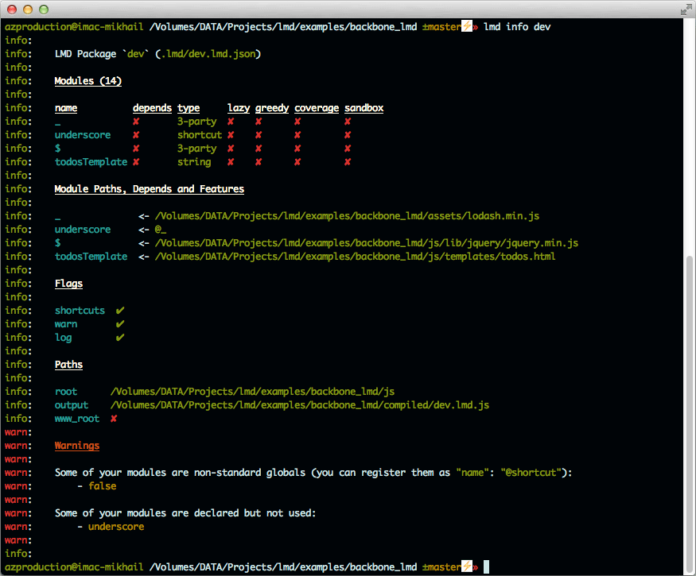

# LMD: Lazy Module Declaration [](http://travis-ci.org/azproduction/lmd) [](http://badge.fury.io/js/lmd) [](https://gemnasium.com/azproduction/lmd)

New to LMD? See [Getting Started](https://github.com/azproduction/lmd/wiki/Getting-started),
[Wiki](https://github.com/azproduction/lmd/wiki/) and [examples](examples/)

## Why LMD? Why not AMD?

 - Modules are CommonJS
   - Actually LMD can work with any JavaScript modules
   - There is no define wrapper!
   - You can use node modules without dirty hacks like `typeof exports ? :`
   - You can use strings as string without any "template" plugins
   - You can use JSON file as Object
 - Total and honest isolation
   - LMD package is fully-zero-isolated from globals (globals cant access LMD-pacakge, but LMD can)
   - Modules are isolated from LMD and from each module
   - Modules can be sandboxed (3-party modules, can exports only)
   - Plugins are isolated from LMD and from each module
 - Lazy interpretation and load
   - LMD can load off-package modules (all loaders can do it =)
   - It can interpret(eval) modules when they are required
 - List of depends are located in separate .json file
   - Well... list of 2 deps in file are ok, but 5+ are headache
   - Module is isolated from file system
   - You have to edit only 1 file if module path changes
   - Possible to use dynamic require()
 - Config inheritance
   - Easy to setup development, testing and production builds
 - Build watcher
   - Watcher detects changes in your files and performs rebuild
 - Flexible source
   - Minimal only 288bytes
   - High optimized own code
   - LMD builder performs build-time optimisations
 - Integrated code-coverage and source analytics tool
   - Its easy to enable believe me!
   - No extra servers or movements are required for off-package modules Code-Coverage
 - Transparent localStorage cache
   - Change config and html a bit and voila!
 - require() is not overloaded
   - Overloaded require is the way to mess in source
   - require.css() for css
   - require.js() for js (non LMD-modules)
   - require.async() for async LMD-modules (objects, strings, modules)
 - More
   - Can load CSS
   - Can work with Node.js and Worker environment


## What's on the board

  * All builders/loaders stuff
  * [GUI for LMD](images/lmd_gui_prototype.png) (in development)
  * [Build Analyzer](images/coverage_package.png) (1-click code coverage, depends, startup perfomance)
  * Smart and simple CLI tool



## Other features

1. Default modules are CommonJS
2. LMD does not create globals
3. LMD is standalone, tiny and flexible (minimal only 288bytes!)
4. Each function-module can be initialized/evaled on demand (`lazy: true`)
5. LMD module is as easy to debug as normal JavaScript file
6. Build system compresses JavaScript files using UglifyJs
7. LMD module can define object via `return` or `module.exports` or `exports` as CommonJS Module
8. Module can be wrapped automatically in builder so you can write your modules as node.js modules
9. Starting from version 1.5.2 LMD can require off-package modules `"async": true`
(see [Asynchronous module require](https://github.com/azproduction/lmd/wiki/Off-package-modules))
10. From version 1.6.0 LMD can cache all in-package modules in localStorage `"cache": true`
(see [Local Storage cache](https://github.com/azproduction/lmd/wiki/LocalStorage-cache))
11. From version 1.6.2 LMD can include off-package css `css: true` and js-files `js: true`(for jsonp, cross-origin JS or non LMD modules)
12. LMD package is possible to run as Web Worker or execute as Node.js script
(see [Web Worker and Node.js](https://github.com/azproduction/lmd/wiki/Workers-and-Node))
13. LMD works in all modern browsers and in older IE
14. LMD can convert non-LMD modules to LMD to use jquery or any other as in-package LMD module
(see [LMD module form third-party modules](https://github.com/azproduction/lmd/wiki/Adopting-modules))
15. LMD can protect your code from 3-party modules (see [Modules sandbox](https://github.com/azproduction/lmd/wiki/Module-sandbox))
16. Code Coverage? - Easy! (see [Code coverage](https://github.com/azproduction/lmd/wiki/Analytics-and-Code-coverage))
17. Ready for production - `lmd.js` is 100% covered by unit tests see [test/README.md](test) for details
18. SourceMap for all LMD modules (see [Source map](https://github.com/azproduction/lmd/wiki/SourceMap))
19. Reach CLI interface

## Installing

`npm install lmd -g` global is prefered for LMD CLI comands.

## LMD Config file

**Minimal**

```javascript
{
    "root": "../modules/",
    "output": "../module.lmd.js", // Path are relative to the root parameter
    "modules": {
        "*": "*.js" // use wildcards or specify regex string to grep
    }
}
```

See [LMD Config](https://github.com/azproduction/lmd/wiki/LMD-config) for more information

**Note**

 - You can extend config file with another using `"extends": "path/to/file.lmd.json"` parameter
 - You can also specify module depends by adding `"depends"` options see [Modules dependencies](https://github.com/azproduction/lmd/wiki/Module-dependencies)

## Build LMD package from Console

`lmd build your_buiild_name`

See [LMD CLI](https://github.com/azproduction/lmd/wiki/CLI)

## Grunt integration and task

Install this grunt plugin next to your project's [grunt.js gruntfile](https://github.com/gruntjs/grunt/wiki/Getting-started) with: `npm install grunt-lmd`

Then add this line to your project's `grunt.js` gruntfile:

```javascript
grunt.loadNpmTasks('grunt-lmd');
```

See [grunt-lmd](https://github.com/azproduction/grunt-lmd) for details


## Special features

  * glob - you can specify glob pattern (eg `"${name}": "js/*.js"`) to match multiply files. See [demo](http://lmdjs.org/examples/features/glob/), [code](examples/features/glob/)
  * interpolation - you can use templates in your config string values to make your life easier. See [demo](http://lmdjs.org/examples/features/interpolation/), [code](examples/features/interpolation/)
  * sandbox - some of your modules can be in the "sandbox". They cant require, but can provide some resources. See [demo](http://lmdjs.org/examples/features/sandbox/), [code](examples/features/sandbox/)
  * optimize - optimisations of LMD source(not your project files) without minification/packing. See Optimisations section of [LMD Plugins overview](https://github.com/azproduction/lmd/wiki/LMD-Plugins-overview) wiki page. See [demo](http://lmdjs.org/examples/features/optimize/), [code](examples/features/optimize/)
  * adaptation - using any JavaScripts as modules. See Wiki page [Adopting modules](https://github.com/azproduction/lmd/wiki/Adopting-modules). See [demo](http://lmdjs.org/examples/features/adaptation/), [code](examples/features/adaptation/)
  * bundles - a way to split your application into separete parts. See [demo](http://lmdjs.org/examples/features/bundles/), [code](examples/features/bundles/)
  * styles - css builder for you bundles. See [demo](http://lmdjs.org/examples/features/styles/), [code](examples/features/styles/)
  * lmdjs_configs - you can write config files in JavaScript. See [demo](http://lmdjs.org/examples/features/lmdjs_configs/), [code](examples/features/lmdjs_configs/)
  * multi_modules - using jQuery or Backbone with plugins? This feature is for you. See [demo](http://lmdjs.org/examples/features/multi_module/), [code](examples/features/multi_module/)
  * ignore_module - ignore module from build, can be used with glob to ignore some modules. See [demo](http://lmdjs.org/examples/features/ignore_module/), [code](examples/features/ignore_module/)

## Config extras

  * mixins - you can mix your build configs (eg `lmd build index+ru+dev`) to create your special builds. See [demo](http://lmdjs.org/examples/features/mixins/), [code](examples/features/mixins/)
  * depends - your modules can have own depends. You can notify LMD by adding global "depends" paramenter or specify "depends" for each module. See [demo](http://lmdjs.org/examples/features/depends/), [code](examples/features/depends/)
  * extends - your configs can inherit other configs (eg development extends production). See [demo](http://lmdjs.org/examples/features/extends/), [code](examples/features/extends/)

## Bash/zsh completion

Installation `lmd completion >> ~/.bashrc` (or `~/.zshrc`). Do not forget to restart shell.

**Other ways**

  * You can add `. <(lmd completion)` to your rc file
  * Or, maybe: `lmd completion > /usr/local/etc/bash_completion.d/lmd`

## Running tests

`phantomjs` is required to run test via `npm test` see [test](test) for details

--

LMD is developing with help of [these people](AUTHORS)

If you like LMD - ★ it via `npm star lmd`
